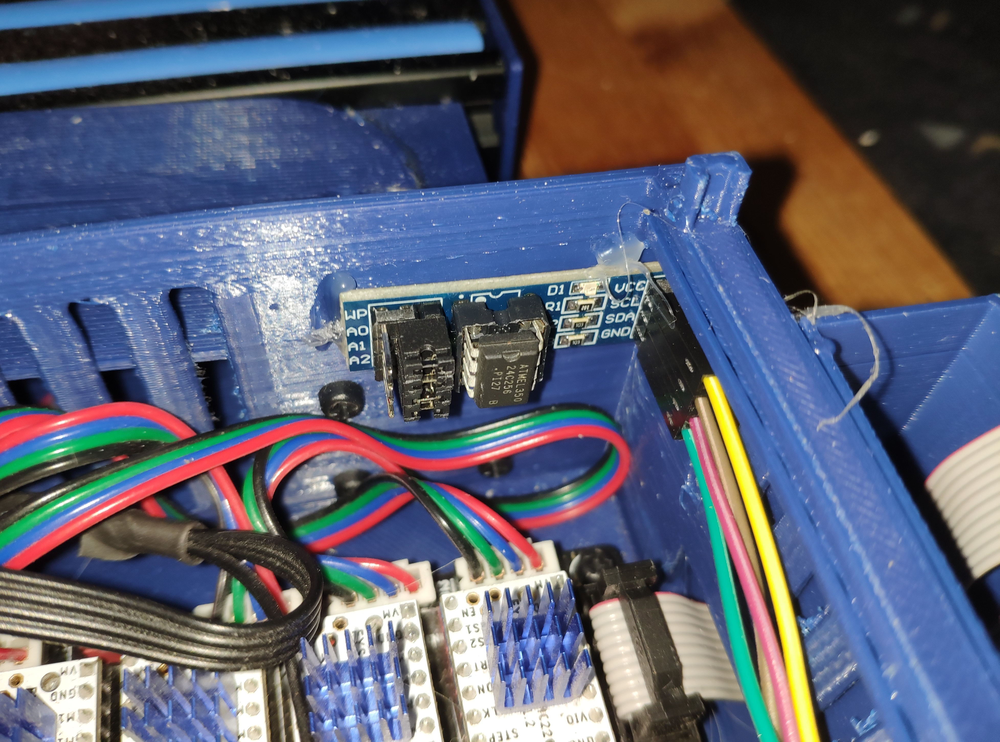

The Mainboard of my A10M printer is a SKR-PRO from Bigtreetech

https://github.com/bigtreetech/BIGTREETECH-SKR-PRO-V1.1

My setup has 3 extruderstepper + 3 stepper for the axis. The SKR-PRO supports up to 6 stepper.
As stepperdriver i use Trinamic TMC2208 from fysetc.

https://wiki.fysetc.com/TMC2208/

https://www.trinamic.com/products/integrated-circuits/details/tmc2208-la/

Im using an external I2C EEPROM

