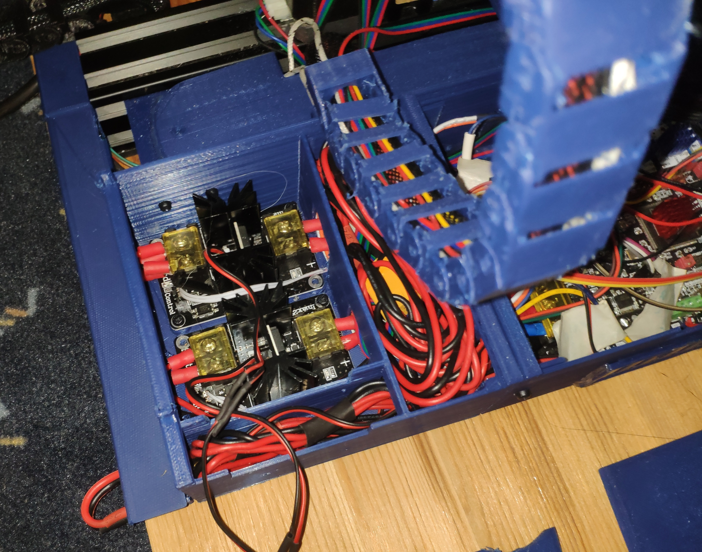

The mainboard is powered from a 24V 120W power supply.

The hotbed and hotend is powered from a second 24V 360W power supply. I turned that ps up to 26V.
With a relais the main power supply can be switched off and on by the mainboard.
The needed power for the hotbed and hotend goes through an external mosfet board.

